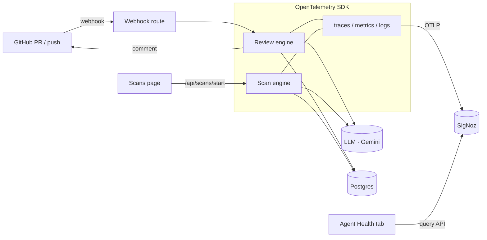

#  Jargons — an observable AI code-review agent

> **If you can't observe your AI agents, you don't own them.**

Jargons is an AI agent that reviews GitHub pull requests and scans whole codebases for bugs, security issues, and structural risks — and every step it takes is **fully observable in [SigNoz](https://signoz.io)** through OpenTelemetry.

Most "AI agent" demos are black boxes: a prompt goes in, an answer comes out, and you have no idea what happened in between — how long it took, how many tokens it burned, what it called, or why it failed. Jargons is the opposite. The agent is instrumented end to end, so you can watch a review as a distributed trace, chart its latency and cost, read its logs correlated to that trace, alert on its failures, and even see its health **inside the product itself**.

Built for the **Agents of SigNoz** hackathon — Track 01, AI & Agent Observability.

---

## What it does

- **PR Review agent** — opens on every pull request (via a GitHub App webhook), fetches the diff, reviews it with an LLM, writes findings, and posts a ` Jargons review` comment back on the PR.
- **Codebase Scan agent** — walks a repository's source files and reports bugs, vulnerabilities, and structural issues, with a full findings detail view.
- **Agent Health** — an in-app dashboard that pulls the agent's *own* live telemetry (latency, token & cost usage, throughput, success rate) straight from SigNoz's query API, scoped per workspace.

## The observability story

The whole agent speaks **vendor-neutral OpenTelemetry (OTLP)**. SigNoz is the backend, selected entirely by environment variables — swap it for SigNoz Cloud or a Kubernetes deployment without touching code.

Every review is a distributed trace:

```
review.run                      ← root span (workspace, repo, PR #)
├─ github.fetch_diff            ← client span to api.github.com
├─ llm.review                   ← GenAI span: model, input/output tokens, cost
├─ db.write_findings            ← Postgres span
└─ github.post_review           ← posts the comment back
```

Scans produce the same shape (`scan.run → github.fetch_tree → github.fetch_files → llm.scan → db.write_summary`).

### Every SigNoz signal, used

| Signal | How Jargons uses it |
|---|---|
| **Traces** | Full span tree per review/scan, plus auto-instrumented client spans to GitHub, the LLM API, and Postgres — SigNoz's **service map** draws the agent's dependency graph automatically. |
| **Metrics** | 12 custom metrics — throughput, duration histograms, findings by severity, failures by stage, LLM tokens & cost — all tagged by `workspace`. |
| **Logs** | Structured logs emitted inside the active span, so each log line is correlated to its trace (click a slow review → jump to its logs). |
| **Dashboards** | A committed "Review Agent Health" dashboard ([`signoz/dashboard-review-agent.json`](signoz/dashboard-review-agent.json)). |
| **Alerts** | Failure-rate, LLM-latency, and daily-cost-budget alerts. |
| **Exceptions** | Every failure calls `recordException`, so LLM quota errors and network timeouts surface in SigNoz's Exceptions view. |
| **Query API** | The in-app **Agent Health** tab queries SigNoz directly for live token & cost telemetry. |

Observability is a **side channel**: if SigNoz is down, the agent keeps reviewing pull requests. The product never depends on it.

---

## Architecture



## Tech stack

- **TanStack Start** (React 19, file-based routing, server functions) on a **Nitro** node server
- **Drizzle ORM** + **Postgres**
- **OpenTelemetry** (Node SDK, auto-instrumentations, OTLP proto exporters) → **SigNoz**
- **LLM: provider-agnostic** (`LLM_PROVIDER` / `LLM_MODEL`) — defaults to **Google Gemini** (`gemini-2.5-flash`)
- Tailwind CSS v4

The LLM adapter is swappable by env var: build on Gemini's free tier, switch to Claude/GPT/anything in production without a rewrite — the same design philosophy as the swappable observability backend.

---

## Getting started

### 1. Run SigNoz

```bash
git clone -b main https://github.com/SigNoz/signoz.git
cd signoz/deploy/docker && docker compose up -d
```

SigNoz UI: http://localhost:8080 · OTLP ingest: `http://localhost:4318`.

### 2. Configure environment

Copy `.env.example` to `.env` and fill in:

```bash
DATABASE_URL=postgres://...
GITHUB_CLIENT_ID=...            # GitHub OAuth (sign-in)
GITHUB_CLIENT_SECRET=...
GITHUB_REDIRECT_URI=http://localhost:3000/auth/github/callback
GITHUB_APP_ID=...               # GitHub App (reviews)
GITHUB_APP_SLUG=...
GITHUB_APP_PRIVATE_KEY=...      # single line, \n-escaped
GITHUB_WEBHOOK_SECRET=...       # matches the App's webhook secret
SESSION_SECRET=...

LLM_PROVIDER=gemini
LLM_MODEL=gemini-2.5-flash
GEMINI_API_KEY=...              # aistudio.google.com/app/apikey

OTEL_SERVICE_NAME=jargons-review-agent
OTEL_EXPORTER_OTLP_ENDPOINT=http://localhost:4318
OTEL_EXPORTER_OTLP_PROTOCOL=http/protobuf
SIGNOZ_API_KEY=...              # for the in-app Agent Health tab
```

Your GitHub App needs **Pull requests: Read & write** and **Contents: Read**, subscribed to **Pull request** events, with its webhook pointed at `/api/github/webhook` (use a tunnel like [smee.io](https://smee.io) locally).

### 3. Install, migrate, run

```bash
npm install
npm run db:migrate
npm run dev        # or: npm run build && npm start  (production)
```

The dev server is launched with OpenTelemetry preloaded:

```bash
NODE_OPTIONS="--import ./instrumentation.mjs" npm run dev
```

Open a pull request on a connected repo → watch the review appear on the PR **and** the trace, metrics, logs, and cost light up in SigNoz. See [`OBSERVABILITY.md`](OBSERVABILITY.md) for the full observability guide.

---

## Repository layout

| Path | What's there |
|---|---|
| `instrumentation.mjs` | OpenTelemetry bootstrap (traces, metrics, logs → OTLP) |
| `src/server/review-engine/` | PR review agent (github, llm, orchestrator) |
| `src/server/scan-engine/` | Codebase scan agent |
| `src/server/observability.ts` | Shared tracer + custom metrics + trace-correlated logs |
| `src/server/agent-health.ts` | In-app health, backed by DB + the SigNoz query API |
| `src/routes/api.github.webhook.tsx` | Webhook ingestion (HMAC-verified) |
| `signoz/dashboard-review-agent.json` | Importable SigNoz dashboard |
