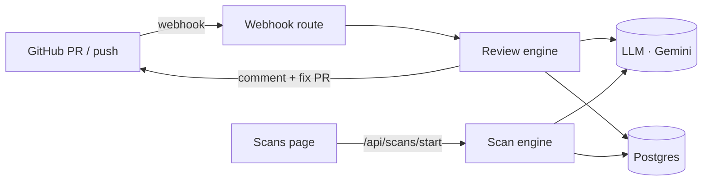

# Jargons — AI code review that gets your code

[](LICENSE)
[](CONTRIBUTING.md)
[](https://github.com/devtofunmi/jargons/actions/workflows/ci.yml)

Jargons is an AI agent that reviews GitHub pull requests and scans whole codebases for bugs, security issues, and structural risks — then opens a pull request that applies the fixes.

Install the GitHub App, and every pull request gets an automatic review: findings with severity and file locations posted as a comment, plus a companion PR that applies the suggested fixes for you to review and merge.

**Live:** [jargons.run](https://www.jargons.run)

---

## What it does

- **PR Review agent** — opens on every pull request (via a GitHub App webhook), fetches the diff, reviews it with an LLM, writes findings, and posts a branded **Jargons review** comment back on the PR. When the findings are fixable, it also **opens a companion pull request that applies the fixes**.
- **Codebase Scan agent** — walks a repository's source files and reports bugs, vulnerabilities, and structural issues, with a full findings detail view. One click — **Open fix PR with Jargons** — turns a scan's findings into a pull request against the default branch.

---

## Architecture



## Tech stack

- **TanStack Start** (React 19, file-based routing, server functions) on a **Nitro** node server
- **Drizzle ORM** + **Postgres**
- **LLM: provider-agnostic** (`LLM_PROVIDER` / `LLM_MODEL`) — defaults to **Google Gemini** (`gemini-2.5-flash`)
- Tailwind CSS v4

The LLM adapter is swappable by env var: build on Gemini, then switch to Claude/GPT/anything in production without a rewrite.

---

## Getting started

### 1. Configure environment

Copy `.env.example` to `.env` and fill in:

```bash
DATABASE_URL=postgres://...
GITHUB_CLIENT_ID=...            # GitHub OAuth (sign-in)
GITHUB_CLIENT_SECRET=...
GITHUB_REDIRECT_URI=http://localhost:3000/auth/github/callback
GITHUB_APP_ID=...               # GitHub App (reviews)
GITHUB_APP_SLUG=...
GITHUB_APP_PRIVATE_KEY=...      # single line, \n-escaped
GITHUB_WEBHOOK_SECRET=...       # matches the App's webhook secret
SESSION_SECRET=...

LLM_PROVIDER=gemini
LLM_MODEL=gemini-2.5-flash
GEMINI_API_KEY=...              # aistudio.google.com/app/apikey
```

Your GitHub App needs **Pull requests: Read & write** and **Contents: Read & write** (the latter lets Jargons commit fixes and open fix PRs), subscribed to **Pull request** events, with its webhook pointed at `/api/github/webhook` (use a tunnel like [smee.io](https://smee.io) locally).

### 2. Install, migrate, run

```bash
npm install
npm run db:migrate
npm run dev        # or: npm run build && npm start  (production)
```

Open a pull request on a connected repo → watch the review appear on the PR, with a companion fix PR when the findings are fixable.

---

## Repository layout

| Path                                      | What's there                                |
| ----------------------------------------- | ------------------------------------------- |
| `src/server/review-engine/`               | PR review agent (github, llm, orchestrator) |
| `src/server/review-engine/open-fix-pr.ts` | Opens a PR that applies review fixes        |
| `src/server/scan-engine/`                 | Codebase scan agent                         |
| `src/server/scans.ts`                     | Scan queries + user-initiated scan fix PRs  |
| `src/routes/api.github.webhook.tsx`       | Webhook ingestion (HMAC-verified)           |

---

## Contributing

Contributions are welcome — bugs, features, docs, and fixes. Start with
[CONTRIBUTING.md](CONTRIBUTING.md) for local setup and the PR workflow, and note
the [Code of Conduct](CODE_OF_CONDUCT.md). Good first steps:

- Grab an issue labelled `good first issue` or `help wanted`.
- Open an issue before large changes so we can agree on the approach.
- Run `npm run lint` before opening a PR (`npm run format` auto-formats).

## Security

Found a vulnerability? Please report it privately — see
[SECURITY.md](SECURITY.md). Don't open a public issue for security problems.

## License

[MIT](LICENSE) © devtofunmi
